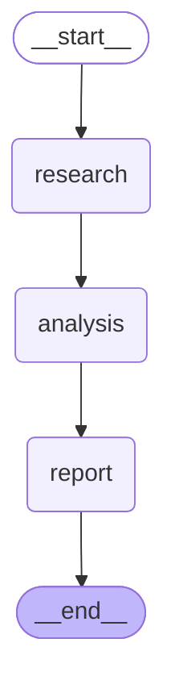

# AI Research Intelligence Pipeline

A stateful LLM research workflow orchestrated with **LangGraph** — a topic goes in, and a structured research report comes out, produced by three explicit graph nodes that share and build on a common state object.

```text
Topic
 ↓
Research
 ↓
Analysis
 ↓
Report
```

This is Project 1 of a LangGraph portfolio, focused on demonstrating core orchestration fundamentals rather than a specific product use case.

## Problem

A single Python function that calls an LLM three times in a row (`research()` then `analysis()` then `report()`) looks simple, but it doesn't scale:

- Error handling, retries, and logging get duplicated in every function.
- There's no single source of truth for what data exists at what point in the pipeline.
- Adding branching, parallelism, human review, or checkpointing later means a rewrite, not an extension.

## Solution

LangGraph turns the workflow into an explicit graph over a shared, typed state:

- **State** — a single `TypedDict` that every node reads from and writes to.
- **Nodes** — pure functions of `(state) -> partial state update`.
- **Edges** — explicit transitions between nodes, controlled by the graph, not by nested function calls.
- **`START` / `END`** — well-defined entry and exit points.

The graph itself owns orchestration. `app.py` never calls `research()`, `analysis()`, and `report()` directly — it builds a `StateGraph`, compiles it once, and calls `.invoke()`.

## Architecture

| Component | File | Responsibility |
|---|---|---|
| State schema | `state.py` | Defines `ResearchState`. No business logic. |
| Configuration | `config.py` | Environment variables, model name, logging setup. No secrets hardcoded. |
| Prompts | `prompts.py` | All LLM prompt templates, isolated from orchestration code. |
| Nodes | `nodes.py` | `research_node`, `analysis_node`, `report_node` — each a factory closing over an injectable LLM client. |
| Graph | `graph.py` | Builds and compiles the `StateGraph`: nodes, edges, retry policy. |
| Utilities | `utils.py` | Report saving, execution metadata helpers. |
| CLI | `app.py` | Entry point: prompts for a topic, runs the graph, prints/saves the report. |

## State model

```python
class ResearchState(TypedDict, total=False):
    topic: str        # user input, set once
    research: str      # written by research_node
    analysis: str       # written by analysis_node, reads research
    report: str          # written by report_node, reads research + analysis
    status: str            # e.g. "research_complete", "report_failed"
    errors: list[str]        # accumulated error messages
    metadata: dict              # execution_id, start_time, completed_nodes
```

Why shared state matters: each node only returns the keys it owns (e.g. `research_node` returns `{"research": ..., "status": ...}`), and LangGraph merges that update into the running state before invoking the next node. This is what lets `analysis_node` read the `research` text that `research_node` wrote, and lets `report_node` read both `research` and `analysis`, without any node importing or calling another node directly.

## Workflow execution

```text
START
  ↓
research_node   reads: topic                  writes: research, status
  ↓
analysis_node   reads: topic, research         writes: analysis, status
  ↓
report_node     reads: topic, research,analysis writes: report, status
  ↓
END
```

If a node fails after exhausting retries, it writes an error into `state["errors"]` and sets a `*_failed` status instead of raising. Downstream nodes detect that status and skip their work (`*_skipped`) rather than operating on missing data — so a partial, inspectable result is always returned from `graph.invoke()`.

### Graph diagram

The compiled graph can render itself as Mermaid, useful for a quick sanity check or a portfolio screenshot:

```python
from graph import build_graph
print(build_graph().get_graph().draw_mermaid())
```



## LangGraph concepts demonstrated

| Concept | Implementation |
|---|---|
| State | `ResearchState` typed dict, shared across all nodes |
| Nodes | `research_node` / `analysis_node` / `report_node` in `nodes.py` |
| Edges | Sequential `add_edge` transitions in `graph.py` |
| START | Workflow entry point |
| END | Workflow completion |
| Error handling | Errors captured in `state["errors"]`, never raised past `graph.invoke()` |
| Retry | Bounded exponential-backoff retry around each LLM call (`invoke_with_retry`), plus a `RetryPolicy` configured per node via `add_node(..., retry_policy=...)` as a graph-level safety net |
| LLM | Google Gemini via `langchain-google-genai` |
| Testing | Full graph executed against a `FakeLLM` — no API key or network required |

## Project structure

```text
01-research-intelligence/
├── README.md
├── requirements.txt
├── .env.example
├── .gitignore
│
├── app.py
├── config.py
├── state.py
├── graph.py
├── nodes.py
├── prompts.py
├── utils.py
│
├── notebook/
│   └── 01_research_intelligence_pipeline.ipynb
│
├── screenshot/             #running locally 
├── tests/
│   ├── __init__.py
│   ├── conftest.py
│   ├── fakes.py
│   ├── test_state.py
│   ├── test_graph.py
│   └── test_utils.py
│
└── examples/
    └── sample_topics.txt
```

## Installation

```bash
pip install -r requirements.txt
```

## Environment

Copy `.env.example` to `.env` and fill in your key:

```env
GOOGLE_API_KEY=your_gemini_api_key_here
GEMINI_MODEL=your_model_name
```

Get a key at [aistudio.google.com/app/apikey](https://aistudio.google.com/app/apikey). `GEMINI_MODEL` is optional — `config.py` falls back to a sensible default and never hardcodes a model you can't override.

### Colab Secrets (recommended in Colab)

Rather than writing a key into a notebook cell, use Colab's built-in Secrets manager (key icon in the left sidebar):

```python
from google.colab import userdata
import os

os.environ["GOOGLE_API_KEY"] = userdata.get("GOOGLE_API_KEY")
```

This keeps the key out of notebook cell output and out of any file that gets committed to GitHub.

## Running

```bash
python app.py
```

```text
Enter research topic: LLM inference optimization
Workflow started
Research completed
Analysis completed
Report generated
```

The full Markdown report is then printed, with an option to save it to `research_report.md`.

## Testing

```bash
pytest
```

All 14 tests pass without a live API key — they run the real, compiled graph against a `FakeLLM` (`tests/fakes.py`) that returns canned, prompt-aware responses. This verifies actual behavior (state propagation, retry/backoff, error handling, skip-on-failure cascading), not just "does the file exist."

## Example

**Input topic:** `LLM inference optimization`

**Representative output** (`research_report.md`, generated against the real Gemini model):

```markdown
# Executive Summary
...

# Background
...

# Key Findings
...

# Analysis
...

# Opportunities
...

# Risks
...

# Engineering Recommendations
...

# Conclusion
...
```

## Design decisions

- **State is separate from nodes.** `state.py` only defines shape; it has zero business logic, so the schema can be reasoned about independently of how it gets populated.
- **Prompts are separate from orchestration.** `prompts.py` holds every prompt template, so prompt engineering iteration never touches `nodes.py` or `graph.py`.
- **LLM calls are isolated behind a minimal `Protocol`.** Nodes depend on an `LLMClient` with a single `.invoke(prompt) -> response` method — they never import `langchain_google_genai` directly. This is what makes dependency injection (and therefore testing) trivial.
- **Tests mock the model.** `FakeLLM` satisfies the same interface as `ChatGoogleGenerativeAI`, so `pytest` exercises the real `StateGraph` — real edges, real state merging, real retry loop — without any network calls.
- **Secrets are environment variables only.** No key is ever hardcoded; `.env` is git-ignored; `.env.example` documents the expected variables without real values.

## Limitations

- Research is **LLM-generated synthesis**, not live web retrieval — the research node does not browse the internet, and its prompt explicitly says so.
- No external research APIs (arXiv, Semantic Scholar, etc.) are integrated.
- No persistent production database — each run is stateless once the process exits.
- No source citations — output reflects the model's training data, which may be outdated or incomplete for fast-moving topics.
- This is a **production-oriented portfolio project**, not a deployed enterprise system.

## Future improvements

- Web search / retrieval tools feeding the research node with live sources
- Retrieval-augmented generation (RAG) over a curated document set
- Source citations attached to specific claims in the report
- Persistent checkpointing (LangGraph's built-in checkpointer/store support)
- Human-in-the-loop approval before the report node runs
- Multi-agent research (parallel sub-topic research nodes fanning in to analysis)
- Structured tracing/observability (e.g. LangSmith)
- Automated evaluation of report quality against a rubric
