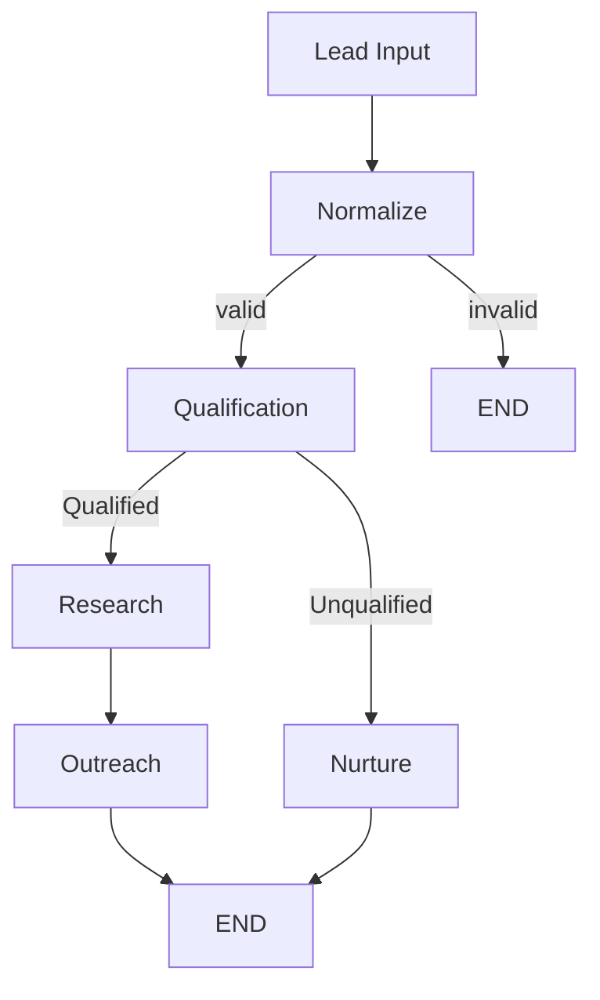

# Intelligent Sales Lead Agent

A stateful, conditional sales workflow orchestrated with LangGraph and Gemini.

**Project 2** of a LangGraph portfolio. Project 1 demonstrated a sequential
graph (nodes → edges → state → linear execution). Project 2 demonstrates a
**state-driven, conditional workflow**: the graph itself decides which path
a lead takes, based on state written by an LLM call earlier in the graph.

```text
PROJECT 1                          PROJECT 2
Sequential workflow                Conditional workflow
Research → Analysis → Report       Lead → Qualification
                                               │
                                        ┌──────┴──────┐
                                        ▼             ▼
                                   Qualified     Unqualified
                                        │             │
                                    Research       Nurture
                                        │
                                    Outreach
```

---

## Problem

A single LLM prompt ("qualify this lead and write an email") cannot express
*branching business logic*. Real sales workflows need to make a decision --
qualified vs. unqualified -- and then take genuinely different actions
depending on that decision, with the decision itself recorded as durable,
inspectable state. That requires an orchestration layer with explicit state
and explicit conditional transitions, not just a chain of prompts.

## Solution

```text
Lead
 │
 ▼
Qualification (LLM-assisted, structured output)
 │
 ▼
State-driven routing (LangGraph conditional edge)
 ├── Qualified   → Research → Outreach
 └── Unqualified → Nurture
```

The LLM provides *analysis*. LangGraph provides *orchestration and control
flow*. The routing decision is made by `add_conditional_edges`, not by an
`if/else` wrapped around the graph.

## Architecture



There are actually **two** conditional edges in this graph:

1. **After `normalize`** -- a lead missing required fields is routed
   straight to `END` and never reaches the qualification LLM call.
2. **After `qualify`** -- the central decision of the project: qualified
   leads go to `research → outreach`, everyone else goes to `nurture`.

## LangGraph Concepts Demonstrated

| Concept            | Implementation                                              |
| ------------------ | ------------------------------------------------------------ |
| State              | Typed `SalesState` (`state.py`)                              |
| Nodes              | `normalize`, `qualify`, `research`, `outreach`, `nurture`    |
| Edges              | Fixed transitions (`research → outreach → END`, etc.)        |
| Conditional Edges  | `route_after_normalize`, `route_lead`                        |
| Shared State       | Lead data + qualification result threaded through every node |
| LLM                | Gemini 3.6 Flash via `ChatGoogleGenerativeAI`                |
| Structured Output  | `QualificationResult` (Pydantic) via `with_structured_output`|
| Validation          | `validators.py`, enforced before the graph is even reachable in `normalize_lead` |
| Retry              | `RetryPolicy` (graph-level) + `call_with_retry` (node-level) for transient LLM/API failures |
| Testing            | Deterministic fake LLMs (`tests/conftest.py`) -- no network calls |

## State Model

`SalesState` (see `state.py` for full docstrings):

- **Identity**: `lead_id`
- **Raw/normalized lead data**: `lead_name`, `company`, `role`, `industry`,
  `company_size`, `need`, `budget`, `urgency`
- **Qualification**: `qualification_score` (0-100), `qualification_status`
  (`"qualified"` / `"unqualified"`), `qualification_reason`,
  `qualification_strengths`, `qualification_concerns`
- **Downstream content**: `research`, `outreach_message`, `nurture_message`
- **Workflow control**: `next_action` (`"sales_outreach"` / `"nurture"` /
  `"human_review"`)
- **Observability**: `errors` (never silently swallowed), `metadata`

A **score**, not a boolean, is stored, because a score gives the graph
(and any future analytics on top of it) more to work with than a single
bit of information.

## Routing Logic

`route_lead` (in `graph.py`) reads `qualification_status` from state and
returns `"qualified"` or `"unqualified"`. LangGraph then dispatches to the
node registered against that key in `add_conditional_edges`. The routing
function does not call an LLM, does not have side effects, and is directly
unit-testable (`tests/test_routing.py`) independent of the rest of the
graph.

The qualification threshold (default `60`) is configurable via
`QUALIFICATION_THRESHOLD` and is applied as the authoritative signal for
`qualification_status`, even if the model's own free-text "status" field
were to disagree with its own score.

## Why LangGraph?

Three plain Python function calls could technically produce similar output
for the happy path. What they can't cleanly express is:

- **State that survives across steps** and is inspectable at any point
  (useful for logging, testing, and debugging a specific lead's path).
- **A routing decision that's a first-class part of the workflow graph**,
  not an `if` statement hidden in application code -- which matters as soon
  as you want to add a third path (e.g. `human_review`), swap in a
  different qualification model, or visualize/audit the workflow.
- **Retries scoped to individual nodes** rather than the whole pipeline.
- **Composability** -- Project 3 in this portfolio adds a human-approval
  step by inserting new nodes/edges into this same graph shape, not by
  rewriting the pipeline.

## Project Structure

```text
02-sales-agent/
├── README.md
├── requirements.txt
├── .env.example
├── .gitignore
├── app.py            # CLI entrypoint
├── config.py          # env/config loading
├── state.py            # SalesState TypedDict (no logic)
├── graph.py             # StateGraph + conditional edges
├── nodes.py               # normalize / qualify / research / outreach / nurture
├── prompts.py               # all prompt templates
├── validators.py              # input validation
├── utils.py                     # logging, retry helper, lead id
├── tests/
│   ├── conftest.py                # deterministic fake LLMs
│   ├── test_state.py
│   ├── test_routing.py
│   ├── test_validators.py
│   └── test_graph.py
|
├── notebook/
|   └── Intelligent_Sales_Lead_Agent.ipynb
|
├── screenshot/
|
└── examples/
    ├── qualified_lead.json
    └── unqualified_lead.json
```

## Installation

```bash
pip install -r requirements.txt
```

## Environment

```env
GOOGLE_API_KEY=...
GEMINI_MODEL=gemini-3.6-flash
QUALIFICATION_THRESHOLD=60
MAX_LLM_RETRIES=2
LOG_LEVEL=INFO
```

Copy `.env.example` to `.env` and fill in a real key. **Never commit `.env`.**

## Running

```bash
python app.py                        # interactive prompts
python app.py --example qualified     # run examples/qualified_lead.json
python app.py --example unqualified   # run examples/unqualified_lead.json
```

## Testing

```bash
pytest -q
```

29 tests, all passing, none requiring network access or a real API key --
every LLM call in the test suite is replaced with a deterministic fake
(`tests/conftest.py`).

## Example

### Qualified

```text
Score: 84
Status: qualified
Path: Research → Outreach
Next Action: sales_outreach
```

### Unqualified

```text
Score: 28
Status: unqualified
Path: Nurture
Next Action: nurture
```

(Both of the above are from an actual `graph.invoke()` run included in the
Colab notebook, using a deterministic mock model; see below for the live
Gemini flow.)

## Live Gemini Execution

Set `GOOGLE_API_KEY` (Colab: via `google.colab.userdata`, locally: via
`.env`) and run `python app.py --example qualified`. `nodes.py` builds the
model lazily in `get_qualification_llm` / `get_research_llm` /
`get_content_llm`, so no network call happens until a node actually
executes -- the graph, routing, and tests all work identically with or
without a configured key (tests always use the fakes; only `app.py` and the
Colab notebook use the real model).

## Design Decisions

- **Why state is typed**: `SalesState` documents, in one place, every field
  any node can read or write, and gives editors/type-checkers something to
  check against.
- **Why routing is handled by LangGraph**: so the branching decision is
  visible in the graph topology (`get_graph().draw_ascii()`), not buried in
  application code.
- **Why qualification is structured**: a Pydantic schema
  (`QualificationResult`) avoids fragile string-parsing of LLM output and
  fails loudly (as a `TransientLLMError`, which is retried, then surfaced
  in `errors`) rather than silently on malformed output.
- **Why prompts are separated**: `prompts.py` keeps node code focused on
  control flow, and keeps prompt copy reviewable/editable in one file.
- **Why tests mock the LLM**: routing behavior is the thing under test in
  this project, and it must be deterministic and network-free to be
  trustworthy in CI.
- **Why API credentials are externalized**: `config.py` only ever reads
  from the environment; nothing here should ever contain a real key.

## Limitations

Being honest about scope:

- No live CRM integration.
- No live web research -- `research_lead` is explicitly an **LLM-based lead
  research synthesis** from the fields already on the lead, not verified
  external research.
- No email delivery -- `outreach_message` / `nurture_message` are generated
  text, not sent messages.
- Qualification quality depends entirely on the underlying model's output.
- No human-approval step (that's Project 3).

## Future Improvements

- CRM integration (e.g. HubSpot/Salesforce as the lead source)
- A real web-search tool wired into `research_lead`
- RAG over company/product information for sharper research briefs
- Persistent lead state (currently each `graph.invoke()` is stateless)
- Human-in-the-loop approval before outreach is sent
- Email provider integration for actual delivery
- LangSmith observability / tracing
- An evaluation dataset for qualification accuracy
- A/B testing of outreach copy
- A feedback loop from sales-rep outcomes back into qualification

---

## Interview Discussion Points

**Why LangGraph?**
Because the workflow contains explicit state and branching execution --
the routing decision is part of the graph, not hidden in application code.

**Why not just call three functions?**
Because LangGraph makes workflow state, transitions, routing, retries, and
future workflow expansion explicit and inspectable, instead of implicit in
control flow.

**Where is the state?**
In `SalesState` (`state.py`), threaded through every node.

**Where is routing?**
In the conditional edges after `normalize` and after `qualify`
(`graph.py`).

**What determines the route?**
The qualification state (`qualification_status`, derived from
`qualification_score` vs. `QUALIFICATION_THRESHOLD`).

**What does the LLM do?**
It performs qualification analysis, research synthesis, and outreach/
nurture content generation.

**What does LangGraph do?**
It orchestrates state transitions, node execution, conditional dispatch,
and per-node retries.

**What happens if the lead is unqualified?**
The graph routes to the `nurture` node instead of `research`/`outreach`,
and `next_action` is set to `"nurture"`.

**How are tests performed without an API key?**
Every LLM factory function in `nodes.py` (`get_qualification_llm`,
`get_research_llm`, `get_content_llm`) is monkeypatched in tests to return
a deterministic fake object with a matching `.invoke()` method -- see
`tests/conftest.py`.
