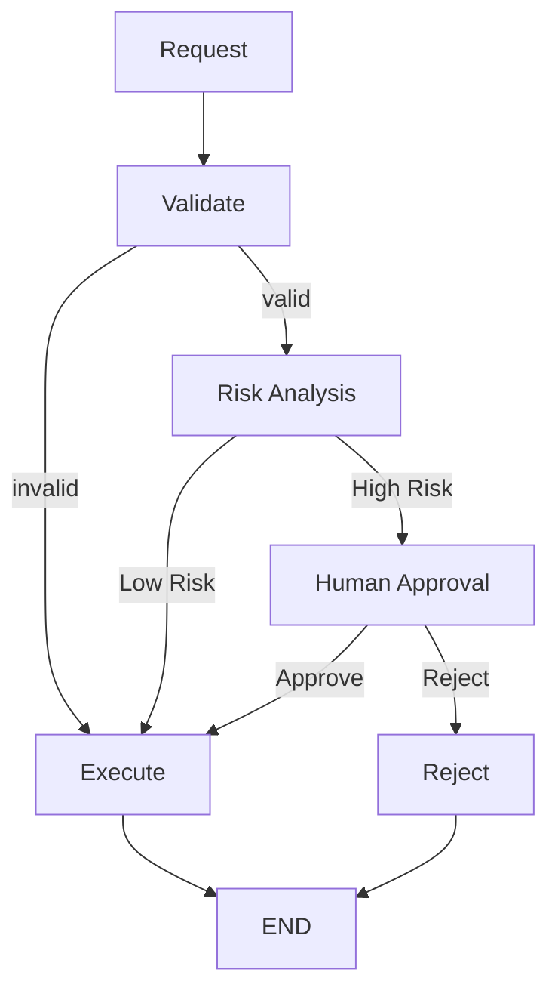

# Enterprise Human Approval Workflow

A stateful, risk-aware, human-in-the-loop AI workflow orchestrated with LangGraph.

> **Project 3** of a three-part LangGraph portfolio demonstrating increasingly
> advanced enterprise agentic patterns. See [Portfolio Progression](#portfolio-progression).

---

## Table of Contents

- [Problem](#problem)
- [Solution](#solution)
- [Architecture](#architecture)
- [State Lifecycle](#state-lifecycle)
- [LangGraph Concepts Used](#langgraph-concepts-used)
- [Why Human-in-the-Loop?](#why-human-in-the-loop)
- [Checkpointing](#checkpointing)
- [Policy vs. LLM](#policy-vs-llm)
- [Project Structure](#project-structure)
- [Setup](#setup)
- [Running the CLI](#running-the-cli)
- [Running the Tests](#running-the-tests)
- [Security Design](#security-design)
- [Interview Discussion Points](#interview-discussion-points)
- [Limitations](#limitations)
- [Future Improvements](#future-improvements)
- [Portfolio Progression](#portfolio-progression)

---

## Problem

Traditional AI agents can make decisions autonomously, but enterprise systems
often require:

- approval gates
- governance
- auditability
- risk controls
- human intervention

A reliable enterprise AI system therefore needs to support a pattern like:

```text
AI Analysis
     ↓
Risk Assessment
     ↓
Policy
     ↓
Human Approval
     ↓
Controlled Execution
```

## Solution

This project uses **LangGraph** to orchestrate the entire lifecycle of a
sensitive business request:

- **state** — a single typed object carried through the whole workflow
- **nodes** — validation, risk analysis, human approval, execution, rejection
- **conditional routing** — risk-based and approval-based branching
- **interruption** — the graph genuinely pauses for a human decision
- **checkpointing** — paused state survives until a human responds
- **resumption** — execution continues from exactly where it paused
- **controlled execution** — a simulated action, gated by policy and humans

This is **not** a chatbot. There is no open-ended conversation — it is a
governed, auditable business process with an AI-assisted risk assessment
step in the middle.

## Architecture



The high-risk path in detail:

```text
HIGH RISK

Analyze
   ↓
interrupt()
   ↓
Checkpoint
   ↓
Human Decision
   ↓
Command(resume=...)
   ↓
Continue Graph
```

The graph itself — not application code outside the graph — controls every
transition. Routing decisions live in `route_validation`, `route_risk`, and
`route_approval` in `nodes.py`, and are wired in via
`add_conditional_edges` in `graph.py`.

## State Lifecycle

```text
Initial State
     ↓
Request information        (requester, department, action, amount, reason)
     ↓
Validation                 (errors, request_id)
     ↓
Risk Analysis               (Gemini call)
     ↓
risk_score / risk_level / risk_reason / risk_factors
     ↓
approval_required           (deterministic policy decision)
     ↓
interrupt()                 (only if approval_required)
     ↓
human_decision               (approve / reject)
     ↓
execution_status
execution_result
```

Every node reads from and writes to this one `ApprovalState` object
(`state.py`). Nothing about the workflow's progress lives anywhere else,
which is what makes it inspectable and resumable at any point.

## LangGraph Concepts Used

| Concept            | Implementation                              |
| ------------------ | -------------------------------------------- |
| State              | `ApprovalState`                              |
| Nodes              | Validate, Analyze, Human Approval, Execute, Reject |
| Edges              | Workflow transitions                          |
| Conditional Edges  | Validation, risk, and approval routing        |
| Interrupt          | Human approval (`interrupt()`)                |
| Checkpointing      | `InMemorySaver`, keyed by `thread_id`         |
| Resume             | `Command(resume=...)`                         |
| Retry Policy       | `RetryPolicy` on the `analyze` node           |
| LLM                | Gemini (`langchain-google-genai`)             |
| Policy             | Deterministic risk-score threshold            |
| Testing            | Mocked LLM, real checkpointer                 |
| Logging            | Python `logging`                              |

## Why Human-in-the-Loop?

Humans should stay in the loop whenever a decision involves:

- high financial risk
- security-sensitive actions
- irreversible operations
- regulatory decisions
- privileged access
- high-impact business actions

**AI assists decision-making; policy and human governance control sensitive
execution.**

## Checkpointing

```text
Graph
 ↓
interrupt()
 ↓
Checkpoint
 ↓
Pause
 ↓
Human decision
 ↓
Resume
```

Checkpointing allows the workflow state to survive the interrupt so
execution can continue from the paused point. Without a checkpointer,
`interrupt()` would have nowhere to persist state, and there would be
nothing to resume — the process would simply have to start over.

This portfolio implementation uses LangGraph's **in-memory checkpointer**
(`InMemorySaver`) for demonstration purposes. **This is explicitly not
durable production persistence** — if the Python process restarts, all
paused workflows are lost. A production deployment would swap this for a
durable checkpointer (e.g. Postgres) without changing any node or graph
logic; `build_graph(checkpointer=...)` accepts any LangGraph-compatible
checkpointer.

### Thread IDs

Every workflow execution is tied to a unique `thread_id`:

```python
config = {"configurable": {"thread_id": request_id}}
```

The **same** `thread_id` must be used both to start the workflow and to
resume it later — the checkpointer uses it as the key for the paused
state. Mixing up thread IDs (or omitting one) means resuming a *different*
conversation or none at all. Using the `request_id` as the `thread_id`
keeps this natural and traceable end-to-end.

## Policy vs. LLM

```text
LLM
 ↓
Risk Assessment
 ↓
Structured State
 ↓
Deterministic Policy
 ↓
Human Approval Requirement
```

The LLM (`analyze_request` in `nodes.py`) only ever produces a **risk
assessment** — a score, a level, a reason, and risk factors. It never
decides whether to execute anything. A separate, deterministic function
(`decide_policy`) turns that score into an `approval_required` flag using
a configurable threshold (`HIGH_RISK_THRESHOLD`). The graph's routing
functions then act on that flag — never on raw model text.

This means: **the LLM cannot make execution happen.** Even if a model
response were manipulated or hallucinated in a way that suggested "this is
fine, go ahead," it can only ever move the `risk_score` field — the
policy layer and the human approval gate still stand between that field
and any real execution.

## Project Structure

```text
03-human-approval-workflow/
│
├── README.md
├── requirements.txt
├── .env.example
├── .gitignore
│
├── app.py
├── config.py
├── state.py
├── graph.py
├── nodes.py
├── prompts.py
├── validators.py
├── utils.py
│
├── screenshot/
├── notebook/
├── tests/
│   ├── __init__.py
│   ├── test_state.py
│   ├── test_routing.py
│   ├── test_approval.py
│   ├── test_validators.py
│   └── test_graph.py
│
└── examples/
    ├── low_risk_request.json
    ├── high_risk_request.json
    └── rejected_request.json
```

## Setup

```bash
pip install -r requirements.txt
cp .env.example .env   # then fill in your own GOOGLE_API_KEY
```

In **Google Colab**, instead of a `.env` file, inject your key from Colab's
secret manager and never paste it into a cell:

```python
from google.colab import userdata
import os

os.environ["GOOGLE_API_KEY"] = userdata.get("GOOGLE_API_KEY")
```

## Running the CLI

```bash
python app.py
```

You will be prompted for requester, department, action, amount, and reason.
Low-risk requests execute immediately. High-risk requests pause and ask you
to type `approve` or `reject`.

## Running the Tests

```bash
pytest -q
```

No `GOOGLE_API_KEY` is required to run the tests — the LLM call is mocked
throughout (`tests/test_graph.py`), while `tests/test_approval.py` exercises
the real `interrupt()` / checkpoint / `Command(resume=...)` mechanism
end-to-end with a real (in-memory) checkpointer.

## Security Design

```text
LLM
 ↓
Structured Risk Assessment
 ↓
Deterministic Policy
 ↓
Human Approval
 ↓
Controlled Execution
```

- The execution layer (`execute_request`) is **entirely simulated**. It does
  not connect to any real financial, production, infrastructure, or
  access-control system.
- Invalid input is rejected by pure Python validation **before** the LLM is
  ever called (`route_validation`).
- Invalid human decisions (anything other than exactly `approve` or
  `reject`) fail safe to a rejection — they never fall through to execution.
- Secrets are read from environment variables only; nothing is hardcoded,
  and `.gitignore` excludes `.env` files from version control.

## Interview Discussion Points

**Why use LangGraph?**
Because the workflow is stateful, branching, interruptible, and resumable —
properties a plain function call or a simple prompt chain does not give you
for free.

**Why not use a normal Python function?**
Because the workflow needs explicit graph transitions, checkpointing, and
interruption semantics — a paused workflow needs somewhere durable to
"live" between the interrupt and the human's response, potentially across
different processes or requests.

**What does `interrupt()` do?**
It pauses graph execution at that exact point and surfaces a payload to the
caller. The graph does not resume on its own; it waits for
`Command(resume=...)` against the same thread.

**Why is a checkpointer needed?**
Because the graph needs to preserve its state while execution is paused —
otherwise there would be nothing to resume from.

**How does resume work?**
Using the same `thread_id` configuration used to start the run, plus
`Command(resume=<decision>)`. The graph continues from the interrupted node
rather than restarting from `START`.

**Why not let the LLM decide whether to execute?**
Because high-impact actions should be controlled by deterministic policy
and human governance rather than unrestricted model output. See
[Policy vs. LLM](#policy-vs-llm).

**What happens if the user rejects?**
The graph routes to `reject_request` and terminates without ever calling
`execute_request`.

**What happens to low-risk requests?**
They bypass human approval entirely and execute automatically — human
approval is a targeted control, not a blanket bottleneck.

**Is this production-ready?**
No. It is a production-*oriented* portfolio implementation that
demonstrates the architecture correctly, with explicit, honest limitations
(below).

## Limitations

This project intentionally does **not** include:

- a real execution layer (execution is simulated)
- durable checkpointing (an in-memory checkpointer is used)
- a real financial system
- a real access-control system
- a production database
- enterprise authentication (SSO/RBAC)
- an external audit platform
- a real policy engine (the policy here is a single configurable threshold)

Model risk assessment is also inherently probabilistic — the same request
can receive slightly different scores across calls. The deterministic
threshold in `decide_policy` exists precisely to put a hard, auditable line
between that probabilistic assessment and what actually happens next.

## Future Improvements

- PostgreSQL / durable checkpointing
- A real policy engine (rules, RBAC-aware)
- SSO and role-based access control
- An audit event store, separate from graph state
- Slack / Teams / email-based approval channels
- CRM or ITSM integration
- Enterprise authorization
- LangSmith tracing
- Systematic model evaluation for the risk-assessment prompt
- Policy-as-code
- Multi-level / escalating approval chains

## Portfolio Progression

```text
PROJECT 1 — Sequential AI Workflow

Research
   ↓
Analysis
   ↓
Report
```

```text
PROJECT 2 — Conditional AI Workflow

Lead
 ↓
Qualification
 ↓
Conditional Routing
 ├── Qualified → Research → Outreach
 └── Unqualified → Nurture
```

```text
PROJECT 3 — Governed AI Workflow (this project)

Request
 ↓
Risk Analysis
 ↓
Policy
 ├── Low → Execute
 └── High → Human Approval
                  ↓
              Approve/Reject
```

Each project adds one major enterprise capability: sequential orchestration,
then conditional branching, then human governance with pause/resume
semantics.
